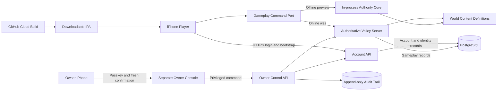
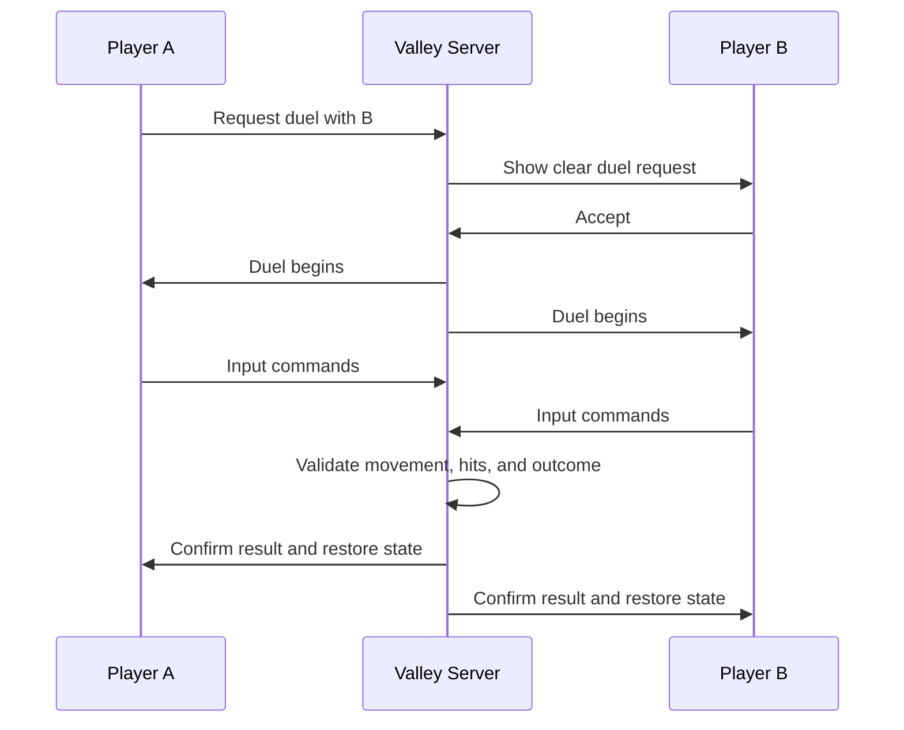

# First Playable Version Design

## Referenced context

#[[file:requirements.md]]
#[[file:../../../docs/GAME_VISION.md]]
#[[file:../../../docs/OWNER_OPERATIONS_SECURITY.md]]
#[[file:../../../docs/COST_DECISIONS.md]]
#[[file:../../../docs/TECHNICAL_BASELINE.md]]
#[[file:../../../docs/CONTROL_PLANE_INVENTORY.md]]
#[[file:../../../docs/TEMPORARY_ASSET_LICENSES.md]]
#[[file:../../../docs/PUBLIC_REPOSITORY.md]]
#[[file:../../../docs/OWNER_ACTIONS_CHECK.md]]

## 1. Purpose

This design turns the first-playable requirements into a small but expandable online game foundation. It does not try to implement the complete MMO vision.

Task 1 pins the implementation baseline in `docs/TECHNICAL_BASELINE.md`. Task 3 still has to prove the real GitHub-to-ESign package, and Task 6 has to measure the online transport on Wi-Fi and cellular. Any item awaiting those tests is labeled provisional rather than assumed successful.

## 2. Verified baseline and proposed services

### Client and world simulation

- **Godot 4.7.2-stable standard build**, using GDScript
- Mobile renderer over Metal, iOS arm64, prototype deployment target iOS 16+
- Third-person 3D mobile client targeting a sustained 30 FPS default on the owner's iPhone 17 Pro Max
- Data-driven resources for items, abilities, cultivation methods, NPC definitions, and world content
- The same Godot version exported in dedicated-server/headless mode for authoritative zone simulation
- Strict JSON `GameplayCommandV1` for the first small prototype, replaceable behind a codec interface

Godot is the current proposal because it is open source, avoids engine royalties, supports iOS export through macOS/Xcode, can produce headless servers, and keeps the project accessible without a locally owned computer.

### Online services

- A small HTTPS account and persistence service
- An authoritative zone server for live movement, combat, gathering, duels, and building
- PostgreSQL for persistent data
- Container-based Linux deployment on a separate game-server host
- Encrypted, authenticated service connections
- HTTPS for account/bootstrap and provisional `wss://` WebSocket transport for the first two-to-ten-player valley

The first server targets two to ten testers. WSS is selected as the smallest Railway-compatible first test, not the permanent MMO transport. Task 6 must measure it on Wi-Fi and cellular; ENet/UDP remains the next candidate if WSS harms action response. Service and command boundaries allow the transport to change without rewriting cultivation, combat, inventory, or world rules.

### Cloud build

- GitHub Actions on the rolling standard `macos-latest` hosted runner, which currently resolves to macOS 26 on Apple silicon
- Use the newest stable default Xcode on that image (currently Xcode 26.6); never select an Xcode public preview
- Pinned Godot 4.7.2 editor/templates with SHA-256 verification
- Godot iOS export followed by a physical-device Xcode build and provisional unsigned ESign package step
- Downloadable unsigned `.ipa` published as a clearly labeled public prerelease asset; no Actions artifact/cache storage for the zero-cost preview
- Owner-authorized manual trigger, one concurrent build, and a 30-minute timeout
- Public standard runner only; larger/custom runners are forbidden
- No signing secret in the current preview; a future signed workflow requires a separate explicit requirements and budget change

GitHub builds the app. A separate host runs the future online server and database. The first workflow may run only after repository visibility is verified public and every safeguard in `docs/PUBLIC_REPOSITORY.md` is present.

### Current zero-cost gate

The current owner-approved budget is **$0**. The source repository is approved to become public; after GitHub confirms the switch, standard `macos-latest` runner compute is free under GitHub's current rules. No paid plan, automatic overage, billable resource, larger/custom runner, Actions cache, or purchase may be activated until the owner explicitly changes that limit. Public source, workflow logs, and prerelease builds contain no secret or private player data.

The zero-cost preview checkpoint is intentionally reachable before hosted account and valley tasks. It uses a small in-process adapter, graybox area, touch movement/camera, one interaction, one combat-input target, and one meditation input. Those pieces are reusable, but the checkpoint is explicitly experimental and does not mark their full gameplay, persistence, online, or owner-console requirements complete.

If no safe hosted option can enforce a true zero-dollar limit, hosted deployment remains prepared but inactive. Development may use local/headless processes in the workspace and an in-process authoritative simulation inside a clearly labeled solo, owner-targeted technical-preview `.ipa` published with a public-download warning. The preview uses the same versioned gameplay command boundary as the future server, but it is not accepted as proof of multiplayer, remote persistence, owner-console security, or the complete online first playable.

Security, privacy, backups, audit, and owner-only access are never weakened to fit a free plan.

Railway Hobby is the owner's current preferred candidate for the first paid hosted test and may be retained if measured results are good. It remains inactive during the $0 stage. Before activation, recheck Railway's current pricing and technical limits, complete `docs/COST_DECISIONS.md`, obtain the owner's explicit monthly maximum, and configure enforceable compute and agent usage limits plus lower alerts. Treat the advertised $5 as a minimum commitment, not a guaranteed maximum.

### Service deployment and owner operations

The chosen service host must provide an iPhone-readable dashboard or a protected GitHub-triggered deployment. The private prototype needs:

- Repeatable container deployment for the account API and valley server
- Versioned database migrations
- Protected service configuration and secrets
- Health checks that do not reveal private data
- Database backups and a written restoration path
- A previous compatible server version available for rollback
- A verified hard $0 spending limit during the current owner-only stage; later, a spending limit or cost alert approved by the owner and visible from the owner's phone

If a provider cannot enforce the current $0 limit, its deployment configuration may be prepared but the hosted resources remain inactive. A client that needs a new protocol is not distributed until a compatible server is healthy.

## 3. High-level architecture



The command port accepts the versioned envelopes defined in `docs/TECHNICAL_BASELINE.md`. Both adapters serialize, parse, validate, and dispatch through the same authority core. The offline adapter is not a UI shortcut and cannot directly mutate valuable state. Time, randomness, physics acceptance, damage, rewards, inventory, cultivation, and claims belong to the authority core.

The client-facing account API accepts account, session, and character-creation commands only. It never accepts a client-provided gameplay save. The account API is the sole writer for account, invite, session, and character-identity records. Once a character enters a valley, that valley server holds a renewable ownership lease and is the sole writer for the character's active gameplay state, inventory, cultivation, claims, NPC effects, and duel state. Every valuable command carries a unique request identifier so safe retries cannot duplicate outcomes.

The owner console never edits the database directly. Its control API authenticates the single configured owner, records the requested reason, and sends a bounded command to the service that owns the affected record. The normal service validates and applies the change, then the control API records the result.

### Trust boundary

The phone is responsible for input and presentation. It may predict harmless movement for responsiveness, but it does not decide valuable outcomes.

The server decides or validates:

- Legal movement and traversal
- Hits, damage, health, and defeat
- Gathering availability and rewards
- Inventory and equipment changes
- Cultivation progress and breakthrough results
- Claim ownership and placed objects
- Duel state
- Important random outcomes

## 4. Repository structure

The initial implementation should use this shape:

```text
/
├── client/                  # Godot iOS game project
│   ├── autoload/            # App-wide state and service adapters
│   ├── authority/           # Command port plus in-process and WSS adapters
│   ├── content/             # Data-driven items, abilities, NPCs, cultivation
│   ├── scenes/
│   │   ├── character/
│   │   ├── combat/
│   │   ├── ui/
│   │   └── world/starter_valley/
│   └── shaders/             # Ink, Qi, and gore-level presentation
├── server/
│   ├── api/                 # Account and persistence service
│   ├── zone/                # Authoritative valley simulation
│   ├── owner-control/       # Owner-only command authorization and audit
│   └── database/            # Versioned schema changes
├── owner-console/           # Separate phone-friendly developer/operations UI
├── shared/
│   ├── protocol/v1/         # Strict command/result schemas and limits
│   └── authority/           # Shared validators and authoritative handlers
├── docs/
├── .github/workflows/       # Reviewed cloud build definitions
└── .kiro/specs/
```

The project should first create skeleton implementations in this structure, confirm that the client, server, and cloud build can connect, and only then flesh out full prototype mechanics.

## 5. Client components

### 5.1 App shell

Responsibilities:

- Boot and version checks
- Private-test authentication
- Server selection supplied by trusted configuration
- Settings and accessibility
- Loading, retry, and clear error screens
- Safe reconnect

Authentication tokens should be stored using an iOS-appropriate protected store. The private prototype can use invite-based account creation and a recovery method. Public account design, including Sign in with Apple, is deferred.

### 5.2 Character creator

The prototype creator supports a young-adult model, name, and a useful but limited set of appearance choices. It stores stable appearance identifiers rather than trusting arbitrary client files.

The character data model reserves fields for origin, age stage, ancestry, body, bloodline, fate, and true Systems without exposing unfinished selections.

### 5.3 Third-person controller

The controller contains:

- Camera-relative movement
- Sprint and stamina hook
- Jump/traversal hook
- Dodge
- Defensive action
- Interaction
- Basic attack and technique buttons
- Optional target lock
- Camera collision and sensitivity
- Mobile safe-area layout

Input is converted into versioned commands. The client predicts ordinary local movement and then reconciles gently to server-approved state.

### 5.4 Combat presentation

A small state machine handles idle, movement, attack, defense, dodge, reaction, defeat, and recovery. Sword and unarmed styles use separate data definitions but share the same combat interface.

Damage and hit results come from the server. Animation, sound, camera response, and cosmetic gore provide local feedback.

### 5.5 Cultivation

The first cultivation feature includes:

- One starter method
- One valid meditation location plus a weaker general option
- Explicit meditation start and stop
- Progress calculated from data
- One threshold
- One interactive breakthrough sequence
- One noticeable reward, such as an enhanced movement burst or first Qi technique

The model must separate method, realm/stage, progress, insight, resources, and temporary condition so later Systems, bloodlines, teachers, injuries, and world laws can influence them without replacing the entire feature.

### 5.6 Inventory and interaction

A shared interaction layer supports gathering, talking, looting, claiming, and object placement. The client asks; the server verifies range, state, ownership, and availability.

Inventory entries refer to versioned item definitions. Unique items receive unique instance identifiers. Stack changes happen as one server transaction to prevent duplication.

### 5.7 Territory sample

The prototype provides a limited set of claimable homes or caves. To avoid permanent shortage during private testing, each account may receive an instanced interior while the entrance exists in the shared valley. The final choice between fully shared plots and expandable pocket interiors remains open.

Placement uses a bounded area, collision checks, ownership checks, and a small catalog. The server stores transforms and item references.

### 5.8 Violence settings

A single `ViolenceProfile` drives blood particles, decals, wound visuals, dismemberment eligibility, and body lifetime. Gameplay collision and rewards never depend on this profile.

The first launch uses a conservative default. A setting change removes or replaces ineligible active effects where practical.

## 6. Server components

### 6.1 Account API

Responsibilities:

- Invite validation
- Account creation and recovery
- Session-token issue and refresh
- Character-identity creation and safe bootstrap reads
- Account-owned transactions only; never client-provided gameplay saves
- Build/protocol compatibility checks
- Administrative revocation for private testing

### 6.2 Authoritative valley server

Responsibilities:

- Connected-player sessions
- Interest management: send only nearby relevant state
- Movement sanity checks
- Creature and named-NPC simulation
- Combat and duel resolution
- Resource-node state
- Cultivation-session validation
- Home claims and object placement
- Periodic and event-driven persistence under a renewable character/zone write lease

The valley server runs a fixed simulation independently of rendering. The initial value is 30 ticks per second, with movement intents capped at 20 per second and state updates starting at 15 per second. The first online adapter uses authenticated WSS with strict TLS verification, a five-second authentication timeout, a 15-second foreground heartbeat, bounded queues, sequence-based stale movement rejection, and reconnect backoff. Task 6 measures and may replace these values after real Wi-Fi and cellular tests.

### 6.3 Persistence and write ownership

PostgreSQL stores durable state. The account API is the only writer for account, invite, session, and character-identity records. An active valley server must acquire a renewable lease before it can become the only writer for that character's gameplay records. A client never uploads a replacement save file. Valuable commands use unique request identifiers, state versions, and transactions so retries are safe and stale writers are rejected.

The zone server may keep active state in memory, but important changes use transactions or idempotent commands. A clean handoff releases or expires the old lease before another zone can write the character.

Suggested core records:

```text
Account
- id
- status
- invite_id
- created_at

CharacterIdentity
- id
- account_id
- name
- appearance_definition
- created_at

CharacterState
- character_id
- position
- age_stage
- origin_fields
- active_zone_id
- zone_write_lease
- state_version
- updated_at

CultivationState
- character_id
- realm_id
- stage_id
- progress
- active_method_id
- condition_data

InventoryItem
- instance_id
- character_id
- definition_id
- quantity
- equipped_slot
- state_data

HomeClaim
- id
- owner_character_id
- plot_or_instance_id
- status

PlacedObject
- id
- claim_id
- definition_id
- transform
- state_data

NpcState
- npc_id
- schedule_state
- goal_state
- persistent_world_state

NpcMemory
- npc_id
- subject_id
- memory_type
- strength
- context

Duel
- id
- requester_id
- recipient_id
- state
- outcome

OwnerIdentity (dedicated identity store)
- owner_subject_id
- passkey_public_credentials
- recovery_state
- status
- identity_version

PrivilegedSession (dedicated identity store)
- id
- owner_subject_id
- environment
- issued_at
- expires_at
- last_fresh_auth_at
- revoked_at

OwnerCommandAudit (external append-only store)
- correlation_id
- owner_or_workload_identity
- credential_and_fresh_auth_reference
- environment
- service
- action
- sanitized_parameters
- target_reference
- affected_record_count
- stated_reason
- before_and_after_versions
- snapshot_and_rollback_references
- requested_started_completed_times
- result_or_safe_error
- previous_entry_hash
```

Owner identity, public credential records, recovery state, and revocations use a dedicated secure identity store rather than gameplay tables. Private passkey material never leaves the owner's authenticator. The audit chain is append-only outside the gameplay database and is anchored to a second protected location so a world restore or altered game database cannot erase privileged history.

All durable records use server-generated identifiers and timestamps. Schema changes are versioned.

### 6.4 Owner-only control plane

The full control-plane model and first-slice feature matrix are defined in `docs/OWNER_OPERATIONS_SECURITY.md` and are binding for this spec.

The developer and operations interface is a separate responsive web console, never a page or overlay in any distributable `.ipa`. Normal clients send only bounded, privacy-limited diagnostics. Unauthorized browser requests fail before protected console HTML, scripts, source maps, menu definitions, operational data, or player data are returned.

One immutable human owner subject is enrolled with a short-lived, single-use bootstrap challenge and a user-verified WebAuthn passkey. Credential additions, removal, replacement, lost-phone recovery, and owner-subject disaster recovery use the documented high-assurance ceremony; player-account recovery cannot affect the owner identity. All previous privileged sessions and credentials are revoked when identity recovery or rotation completes.

The console uses exact-origin WebAuthn, short-lived server-side sessions in Secure/HttpOnly/SameSite cookies, anti-CSRF tokens, restrictive CORS and CSP, frame blocking, no state-changing `GET`, no production source maps, and no cached privileged pages. Sensitive reads and commands require fresh authentication.

The control API exposes a versioned command registry. Each feature task adds its own inspect, diagnose, configure, repair/reset, and verification entries from the operations matrix. A feature cannot be marked complete without those entries or a written not-applicable reason.

Every command is bounded, rate-limited, environment-specific, and idempotent where possible. The control API sends a short-lived, signed, replay-resistant envelope over a private service boundary. The owning account or valley service independently verifies workload identity, audience, environment, owner, nonce, expiry, limits, target, request ID, and expected state version before changing data. Direct public downstream requests are rejected.

Test and live use separate endpoints, databases, secrets, keys, backup stores, service identities, sessions, and command audiences. High-impact live work requires a dry run, affected-record count, state-version check, strict batch limit, fresh backup, rollback plan, fresh passkey verification, reason, and explicit confirmation.

A dormant maintenance executor handles outages without exposing arbitrary SQL or shell access. It can run only reviewed, versioned repair plans after maintenance mode, snapshot, exclusive lease, owner re-authentication, and short-lived environment identity. Emergency controls can pause logins or valuable writes, drain a zone, stop a bad event, notify players, and revoke sessions.

Owner identity, revocation state, and append-only audit history remain outside gameplay backups. A restore is first proven in test and invalidates all sessions, leases, pending commands, and short-lived service credentials. Every privileged read, denial, identity event, command, infrastructure action, deployment, backup, and restore is written to protected external audit storage with the context listed in the operations document.

GitHub, hosting, database, backup, DNS, identity, logging, deployment, and distribution access are part of the same owner-only boundary. Human access is owner-only; narrow machine workloads use short-lived, single-purpose, single-environment identities. There is no standing public database endpoint, raw query console, shared password, or permanent deployment key.

## 7. World design

### Starter valley layout

- **Arrival path:** safe control-learning area
- **Village:** services, named NPCs, brighter presentation
- **Forest:** herbs, optional paths, basic hostile creatures
- **Mountains:** vertical landmarks and future traversal hooks
- **Cave:** darker presentation, stronger encounter, cultivation discovery, possible home claim

Major geography is handcrafted. Resource nodes and simple encounters are data-driven so they can respawn or vary without rebuilding the map.

The introductory experience suggests possibilities but does not force one glowing quest chain. At least one discovery is found through observation or conversation.

## 8. NPC sample

Use at least three named residents:

- A person connected to basic martial training or the sword
- A gatherer, healer, or herbalist connected to resources
- A resident connected to local rumors, the cave, or cultivation

Each has a simple schedule, current goal, and a small memory model. Supported player actions alter relationship or reputation. This is intentionally a thin vertical slice of the future living-world simulation.

## 9. Multiplayer and duel flow



The valley is safe by default. A duel has no item loss. Disconnect resolution is server-controlled and repeatable.

Free-text chat is not required for this first version. Simple presence and optional preset emotes are enough to test sharing the world without prematurely shipping public communication tools.

## 10. Error handling

- **No internet:** remain outside the world and show Retry.
- **Server unavailable:** preserve local settings, show a plain-language message, and retry with backoff.
- **Version mismatch:** tell the player a new `.ipa` is required.
- **Expired session:** refresh safely or return to sign-in without deleting local settings.
- **Rejected input:** correct presentation gently; never grant the requested reward locally.
- **Save conflict:** prefer the last server-confirmed transaction and record a diagnostic identifier.
- **World process restart:** reconnect players to the last confirmed safe state.
- **Invalid placement/gathering:** show a short reason and make no inventory change.

## 11. Security and privacy

- Never trust client-provided rewards, stats, positions, ownership, random results, or privilege claims.
- Rate-limit account, combat, interaction, placement, and privileged-control requests.
- Use short-lived authenticated sessions and encrypted connections.
- Keep the owner control plane separate from the player client and from normal player authentication scopes.
- Allow only the configured owner subject to open a privileged session; no player-facing role change can create another owner.
- Require passkey authentication and fresh re-authentication for destructive or high-impact commands.
- Authorize every owner command on the server, route it through the service that owns the data, and append its result to tamper-resistant audit storage.
- Compile local developer menus and visual overlays out of tester and public clients.
- Store secrets only in deployment/build secret stores; never embed owner authority in an `.ipa` or web bundle.
- Collect only diagnostics needed for reliability, security, and performance.
- Use generic identifiers in logs; do not log authentication secrets.
- Keep the private tester list and every privileged session revocable.
- Use clear environment labels, recoverable snapshots, and extra confirmation to reduce accidental live-world damage.

## 12. Performance strategy

- Target a stable 30 FPS default on the owner's iPhone 17 Pro Max; offer higher frame rate when sustainable.
- Use level-of-detail models, occlusion/frustum culling, limited shadow distances, pooled effects, compressed textures, and bounded creature counts.
- Stream valley sections around the player.
- Use interest management for network entities.
- Simulate deep NPC behavior at reduced frequency when far from players.
- Scale or disable expensive gore effects according to settings and device profile.
- Expose simple graphics presets rather than requiring technical tuning.

## 13. Visual and audio direction for the slice

The prototype must show all four visual ideas in a restrained way:

- Semi-realistic valley foundation
- Bright village or cultivation area
- Ink-like Qi and breakthrough effect
- Dark cave atmosphere

No outside game-content asset is selected for the technical checkpoint. It uses project-authored primitive meshes, materials, interface shapes, and generated test tones. Every later external asset must be approved first in `docs/TEMPORARY_ASSET_LICENSES.md`; a download being free is not enough. Original names, story, symbols, and world details must not copy the works used as inspiration.

Audio needs basic footsteps, interaction, combat impact, ambient world, and cultivation feedback. Music can remain minimal for the first slice.

## 14. Build and release flow

1. Verify repository visibility is public and validate source, history, workflow, selected environment, build mode, and current cost boundary.
2. Refuse automatic triggers, non-standard/larger runners, caches, signing secrets, and paid external services.
3. Build the separate owner console and owner-control API only for the later online version and only within an approved hosting boundary.
4. Export the Godot iOS project on the rolling standard `macos-latest` runner using its newest stable default Xcode and pinned Godot downloads; record the resolved versions and never select an Xcode public preview.
5. Build the same locked player client for owner and tester use, with every developer menu and local debug overlay absent.
6. Package the client as an unsigned `.ipa` suitable for the owner's ESign process.
7. Publish it as a clearly labeled public prerelease asset with environment, mode, version, commit, checksum, and warning that anyone can download it; do not use Actions artifact/cache storage.
8. A zero-cost solo preview is labeled Offline Technical Preview and cannot claim multiplayer, remote persistence, or online owner-console verification.
9. Deploy compatible server changes before distributing an online client that requires them.
10. Reject incompatible online client versions with a plain message.

No certificate, profile, password, passkey private material, API key, owner token, or server secret belongs in committed files or downloadable artifacts.

## 15. Verification approach

A general automated gameplay test suite is outside this first spec. However, the user's explicit requirement that nobody else can access developer tools requires repeatable authorization and secret-leakage security gates. Manual iPhone verification remains evidence-based:

- Public cloud-build log and downloadable public-prerelease `.ipa`, with no secret or private data
- Installation through ESign on the owner's iPhone
- A complete new-character playthrough
- Wi-Fi and cellular connection checks
- A required two-client shared-world and duel check, using either two physical clients or one physical client plus a controlled headless client
- Owner-console operation from the owner's iPhone, including every row in the feature operations matrix
- A test-environment backup restoration followed by required session, lease, and credential invalidation
- The registry-driven authorization matrix for every privileged read and command, including unchanged-state and audit assertions for all denied cases
- Release scans across the repository, `.ipa`, console bundle, service/container artifacts, logs, backup metadata, and audit exports
- Confirmation that the distributable `.ipa` contains no developer menu, local diagnostic overlay, secret, source map, or privileged endpoint
- Close/reopen and interrupted-connection recovery checks
- A 30-minute performance and crash check
- Screenshots or short recordings of each visual mode and gore preset

Additional automated gameplay tests can be added later if the user asks for them. The narrow privileged-access security gates above are mandatory because they are required to support the owner's explicit access boundary.

## 16. Future extension points

The design deliberately reserves boundaries for:

- Child and adult origin experiences
- Unequal bodies, roots, bloodlines, fate, and ancestry
- Aging, seclusion, death, souls, heirs, and reincarnation
- Rare true Systems and transmigration
- Professions, crafting, economy, trade, sects, and cities
- Dangerous PvP regions and expedition loot loss
- Multi-region server handoff and larger player counts
- Other worlds, power systems, laws, universes, and Omniverse-scale progression
- Owner-only content authoring, QA, support, operations, and security controls that grow with every future feature
- Android and computer clients
- Public identity, moderation, support, and optional cosmetics

These are not hidden promises for the first `.ipa`; they remain in the master vision and will receive separate specs.
